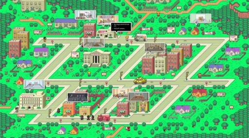
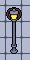
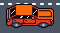

# Death Cab

Documento de diseño de videojuego

*Jiale He, Paula Sierra Luque, Adrián Castellanos Ormeño,*

*Daniel Moreno Álvarez, Nicolás Besteiro Martín*

Versión 2 – 6 de Octubre, 2023

1. ## **Ficha técnica**
Título: Death Cab.

Género: Conducción, Narrativa, Aventura conversacional.

Target: Público amplio

Rating: Pegi 16+.

Plataforma: Navegador Web.

Modos de juego: Un jugador. 

2. ## **Descripción**
La Muerte no puede permitirse pagar el alquiler en el inframundo, y por ello conseguirá trabajo como taxista. Cada día la radio informará de un crimen. El objetivo de la Muerte es recoger gente por la ciudad ejerciendo su profesión, y hablando con ellos en el trayecto. A medida que fluye la conversación, la Muerte tendrá que decidir si llevar a su cliente al infierno, al cielo, o dejarlo vivir, después de analizar su personalidad y si es una posible víctima o culpable del crimen.

Matándolos conseguirá años de vida de almas, moneda del inframundo, con los cuales podrá pagar su alquiler. Si no acierta en el juicio, la Muerte será penalizada, y habrá posibilidad de que no llegue a pagar el alquiler.
3. ## **Jugabilidad**
### **Cámara**
En la fase de conducción, la cámara sería “Top Down” en el estilo de los juegos 2d de GTA. Seguirá al taxi de modo que esté centrado.
### **Mecánicas de conducción**
El jugador conducirá un taxi desde una vista “Top Down” (cenital), mediante el cual podrá interactuar con ciertos objetos del entorno (papeleras, farolas…) y en el que podrá recoger gente, una vez que recoja a alguien se pasará a la parte de diálogo.

- El coche se moverá con las teclas **“W”** (acelerar) **“A”** (izquierda) **“S”** (marcha atrás) **“D”** (derecha), cambiando su ángulo y movimiento en esa dirección. Rotará según la dirección de la fuerza aplicada del vector u 8 direcciones (dependiendo de qué sea más sencillo).
- El coche se podrá frenar con la **tecla *SPACE*.**
### **Mecánicas de diálogo**
Una vez entrado en el minijuego conversacional, comenzará la conversación taxista-cliente. Irán apareciendo y desapareciendo los bocadillos de conversación a medida que se elija la contestación. No se podrá volver atrás en la conversación para recordar qué ha dicho.

Cada vez que el cliente cuente algo, aparecerán dos recuadros con las opciones para contestarle. Según lo que el jugador elija, la conversación fluirá de una manera u otra, especificada en el guión del juego. Para elegir la opción, se usará el **ratón y el click** izquierdo. (IA?) 
### **Sistema monetario**
La moneda principal del juego son **años de vida**. Para ganar años de vida, la Muerte tendrá que llevar a un cliente al infierno o al cielo. En este apartado hay que describir las distintas posibilidades en las que se podría perder dinero.

- Si dejas vivir a un cliente y es alguien que no tenía nada que ver con un crimen, no se ganará dinero pero no habrá penalización.
- Si aciertas, ganarás los años de edad que tenga la persona. Acertar conlleva: +25.
  - Llevar a un culpable al infierno.
  - Llevar a una víctima al cielo.

`	`De esta forma tendremos que haber llevado como mínimo a 4 personas.

- Si fallas, habrá penalizaciones, como:
  - Llevar a un culpable al cielo. Penalización de -15 (por ejemplo).
  - Llevar a una víctima al infierno. Penalización de -15 (por ejemplo)
  - Si era culpable y se le deja vivo. Habrá consecuencias al día siguiente, ya que el culpable seguirá matando (enviando más trabajo al cielo/infierno) y por ello penalización de -10 por gastos de gestión. (por ejemplo)
  - Si era víctima y se le deja vivo. Habrá consecuencias al día siguiente, ya que por su trauma, se suicidará (enviando más trabajo al cielo/infierno) y por ello penalización de -5 por gastos de gestión. (por ejemplo)

El precio del alquiler será de 100 años de vida. Se pagará cada día con el dinero acumulado o con las ganancias.

4. ## **Dinámica**
### **Diseño de niveles**
Es una zona de la ciudad o un distrito en donde conduciremos buscando clientes. En la parte de diseño este tendrá una arquitectura muy realista basada en mapas reales de ciudades. A la hora del diseño en la parte “Visual Novel” el diseño se basará más en el diálogo y cómo estos afectan tus decisiones.

### **Descripción de partida típica**
1. **Presentación del día.** Se muestra en qué día estamos, y comienzan las noticias en la radio. Se explica un crimen que ha sucedido, qué número de personas hay implicadas y una breve descripción de cada una (física y personalidad).
2. **Conducción del taxi**. 

Pasamos la vista desde arriba de la ciudad. Se buscan posibles clientes. Habrá que pararse en un rango cerca de un cliente. Podremos colisionar con elementos de la ciudad (por ejemplo, cubos de basura).

3. Cuando se suba un cliente, entraremos en el **minijuego conversacional**. En él el jugador tendrá que juzgar si su cliente es un posible culpable o víctima del crimen a través del diálogo. Al final de la conversación, el jugador tendrá que decidir si el cliente acabará en el cielo, infierno o lo dejaremos vivir. Dependiendo de nuestra decisión obtendremos más o menos dinero.
4. Volveremos a la conducción en búsqueda de otros clientes. Se repetirán los pasos 2, 3 y 4 hasta pasar el número definido de personas al principio del día.
5. Se nos presentará el **resumen del día**. Ganancias que hemos obtenido, pérdidas, y si podemos o no pasar al siguiente día (si podemos pagar el alquiler).
   1. En el caso de que sea el último día, la Muerte se cansará de las aburridas personalidades de la gente del día a día y por ello, dimitirá para buscarse otro trabajo. Se mostrarán los créditos y se habrá superado el juego.
   2. En el caso de no poder pagar el alquiler, la Muerte será desterrada del inframundo, y por ende, no se habrá superado el juego. Se tendrá que jugar de nuevo, desde el día 1.

5. ## **Estética**
**HUD** 

(Provisional, la localización de los diferentes elementos puede variar dependiendo de las necesidades que se tengan)

Al principio de cada día se indicará el día en el que va a empezar (día 1, día 2…)

En la parte de conducción se mostrarán el número de almas que tiene el jugador.

En la parte de diálogo se mostrarán también los diferentes cuadros de diálogo que se pueden elegir y las respuestas del pasajero a los mismos. (Hay varias opciones que barajar)

6. ## **Contenido**
### **Personajes**
Las personalidades de los clientes estarán basadas en los tipos del [indicador Myers-Briggs o inventario tipológico de Myers-Briggs](https://www.16personalities.com/es/descripcion-de-los-tipos), (también conocido como MBTI), un cuestionario autorreportado que evalúa cómo las personas perciben el entorno y toman decisiones.

<table><tr><th colspan="2">Personaje</th><th>Descripción</th><th>Habilidades</th><th>Foto</th></tr>
<tr><td colspan="2">La Muerte</td><td valign="top">Parado y con apenas dinero para pagar el alquiler del mes, este coge un trabajo como taxista para sobrevivir un poco más. Es el protagonista de nuestro juego, y el único personaje jugable.</td><td valign="top">Tendrá la habilidad de conducir y de decidir quien vive y quien muere</td><td valign="top"></td></tr>
<tr><td rowspan="4">Clientes</td><td>
Azul

(Centinelas)
</td><td colspan="2" valign="top">Son cooperativos, prácticos y fundamentados. Se sienten cómodos con quienes son y se enorgullecen de su buen carácter y su competencia. Estos tipos de personalidad buscan orden, seguridad y estabilidad. Trabajan duro y aspiran a no defraudar a nadie, y esperan que otras personas también adopten esta misma ética.</td><td valign="top"></td></tr>
<tr><td>
Morado

(Analistas)
</td><td colspan="2" valign="top">Conocidos por su amor a la racionalidad, tomando decisiones con la cabeza. Caracterizados por idear estrategias creativas y por la motivación para explorar las cosas. Corren el riesgo de ser superados por aquellos que simplemente se sientan y hacen el trabajo. Además de ser lobos solitarios sin preocuparse por hacer amigos. </td><td valign="top"></td></tr>
<tr><td>
Verde

(Diplomáticos)
</td><td colspan="2" valign="top">Se preocupan por ayudar y conectarse con los demás. Priorizan ser amables y generosos y, en general, prefieren cooperar que competir. Son sensibles a los sentimientos de otras personas y quieren empujar a las personas que los rodean en direcciones positivas. Sin embargo, si no se controla, este rasgo de personalidad puede desencadenar superioridad moral o determinación.</td><td valign="top"></td></tr>
<tr><td>
Amarillo

(Exploradores)
</td><td colspan="2" valign="top">Tienden a ser autosuficientes y de pensamiento rápido. Viven de manejar situaciones inciertas. Su flexibilidad les ayuda a adaptarse al momento. Generalmente prefieren la trabajabilidad y la utilidad a la perfección. Sin embargo no les gusta la monotonía y pueden desviarse de sus obligaciones para probar cosas nuevas.</td><td valign="top"></td></tr>
</table>

### **Elementos del minijuego de conducción**
En el minijuego de conducción, nos encontraremos distintos elementos repartidos por la ciudad que tendrán físicas propias.

<table><tr><th>Nombre del elemento</th><th>Utilidad</th><th>Descripción</th><th>Foto</th></tr>
<tr><td>Carreteras</td><td>Zona por donde será posible la conducción.</td><td>Carriles de color gris oscuro, con líneas blancas que lo delimitan.</td><td></td></tr>
<tr><td>Aceras</td><td>
Zona donde aparecerán los clientes (spawners aleatorios?).

No se puede conducir por aquí (evitamos atropellos digo yo??)
</td><td>
De un color más claro que la carretera para que sea distinguible.

Cuando haya un cliente parado en la acera, aparecerá un círculo, donde tendremos que parar el taxi para que se suba.
</td><td></td></tr>
<tr><td>Edificios</td><td>Zona no transitable delimitada por un colisionador que no se podrá atravesar</td><td>Edificios vistos desde arriba.</td><td></td></tr>
<tr><td>Cubos de basura</td><td rowspan="4">
Obstáculo en la carretera con el que el taxi podrá colisionar, y que producirá una fuerza opuesta a la dirección del taxi.

Si se colisiona con alguno explota.

</td><td>De color más oscuro que la carretera.</td><td></td></tr>
<tr><td>Farolas</td><td>De color blanco.</td><td></td></tr>
<tr><td>Semáforos</td><td>De color verde.</td><td></td></tr>
<tr><td>Coches</td><td>De diferentes colores, no representan nada, solo cumpliran las normas de tráfico. </td><td></td></tr>
</table>

### **Diálogos**
Al ser una aventura conversacional, destacarán los diálogos entre la Muerte y sus clientes. Se adjunta un enlace al documento con el [guión del juego](https://docs.google.com/document/d/129zFDUB82R5n3lG-4UAMDzuIBhxBJ5bjKb2SWjYEkxk/edit#heading=h.4ztyayb9u9vw). (cuando esté en pdf pondremos el enlace bueno)

En el juego distinguiremos dos tipos de conversaciones.

- Se definirán algunas **preguntas y respuestas predeterminadas**, que se irán mezclando para que surja una conversación con sentido.
- Diálogos **acorde al crimen del día**, irán contando una historia a medida que la Muerte pregunte.

7. ## **Referencias**
Para el diseño y desarrollo de Death Cab, se han tomado los siguientes juegos como inspiración y de referencia:

- [Papers Please](https://papersplea.se/). 
- [Crazy Taxi](https://store.steampowered.com/app/71230/Crazy_Taxi/?l=spanish). SEGA.
- [Grand Theft Auto 2](https://www.rockstargames.com/games/gta2). Rockstar Games.
- [Phoenix Wright: Ace Attorney](https://www.ace-attorney.com/). Capcom.

